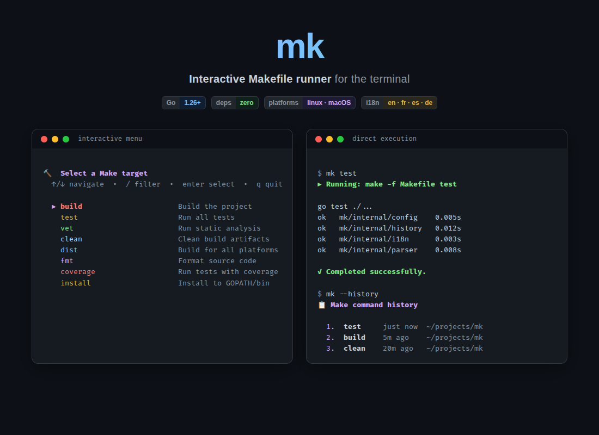
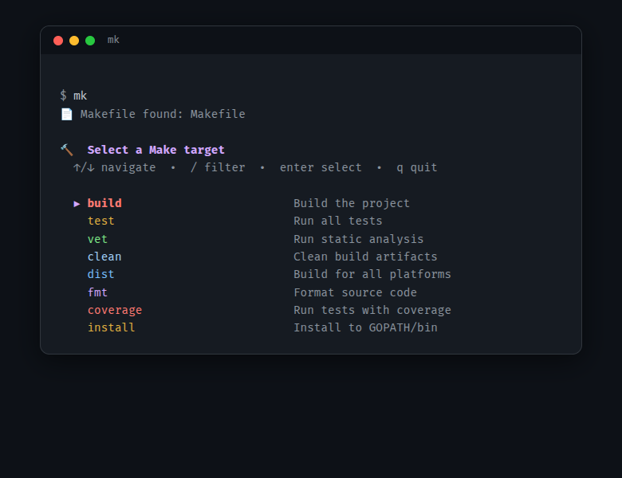
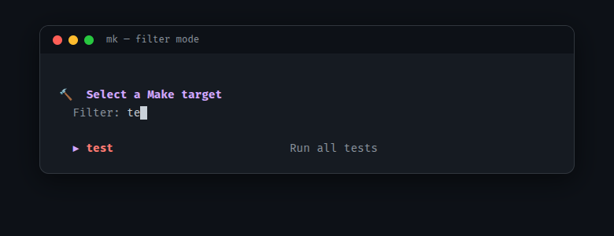
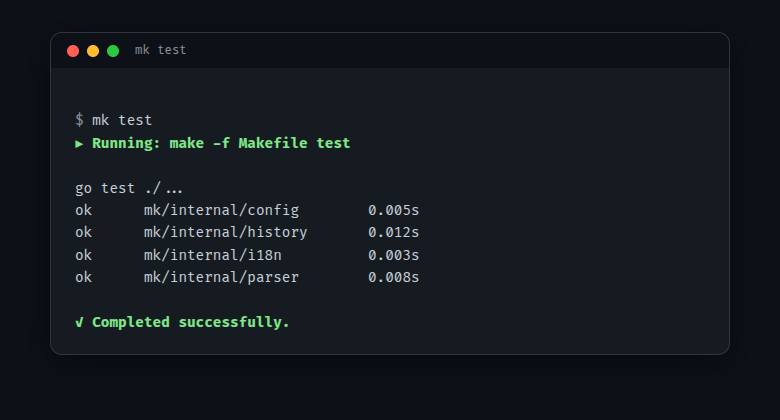
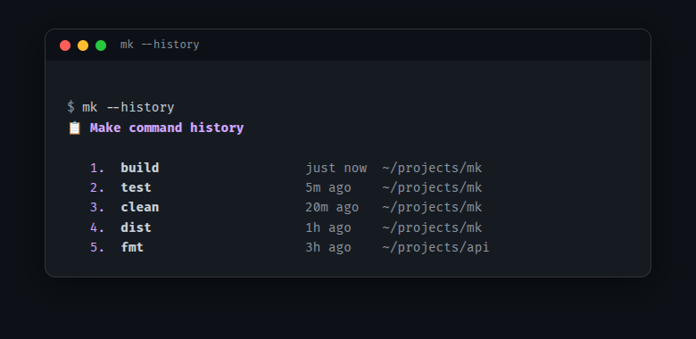
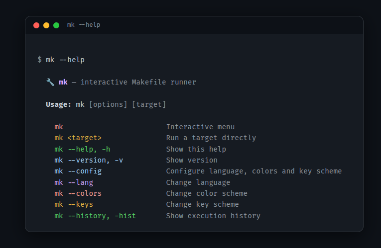

<p align="center">
  
</p>

<p align="center">
  <strong>Browse, filter, and run Makefile targets from an interactive terminal menu.</strong>
</p>

<p align="center">
  <a href="https://github.com/subut0n/mk/actions/workflows/ci.yml"></a>
  <a href="https://github.com/subut0n/mk/releases/latest"></a>
  <a href="LICENSE"></a>
  
</p>

<p align="center">
  <a href="#installation">Installation</a> &middot;
  <a href="#usage">Usage</a> &middot;
  <a href="#features">Features</a> &middot;
  <a href="#configuration">Configuration</a> &middot;
  <a href="#makefile-conventions">Makefile Conventions</a> &middot;
  <a href="#building-from-source">Building from Source</a>
</p>

---

## Why mk?

Running `make` requires you to remember target names, open the Makefile to check what's available, or rely on tab completion that only shows names without descriptions.

**mk** gives you an interactive, filterable menu that surfaces your documented targets with descriptions — pick one with arrow keys and hit Enter. Or pass the target name directly for scripting.

## Installation

### Quick install (recommended)

```bash
curl -fsSL https://raw.githubusercontent.com/subut0n/mk/main/install.sh | sh
```

Pin a specific version:

```bash
curl -fsSL https://raw.githubusercontent.com/subut0n/mk/main/install.sh | sh -s -- --version v1.0.0
```

<details>
<summary>Other install methods</summary>

### go install

```bash
go install github.com/subut0n/mk@latest
```

### Pre-built binaries

Download the latest release for your platform from the [Releases](https://github.com/subut0n/mk/releases) page, then:

```bash
chmod +x mk-*
sudo mv mk-* /usr/local/bin/mk
```

### From source

Requires **Go 1.26+**.

```bash
git clone https://github.com/subut0n/mk.git && cd mk
make build
sudo mv mk /usr/local/bin/
```

</details>

## Usage

```bash
mk              # Launch the interactive menu
mk <target>     # Run a target directly
mk --help       # Show help
mk --history    # Show execution history
mk --config     # Full configuration wizard
```

### Interactive menu

Run `mk` with no arguments in any directory containing a Makefile:

<p align="center">
  
</p>

Navigate with arrow keys (or your configured key scheme), press Enter to execute the selected target.

### Real-time filtering

Press `/` to enter filter mode — type to narrow down targets by name or description:

<p align="center">
  
</p>

### Direct execution

Pass a target name to skip the menu entirely:

<p align="center">
  
</p>

### Execution history

View your recent targets across projects:

<p align="center">
  
</p>

### Help

<p align="center">
  
</p>

## Features

| Feature | Description |
|---------|-------------|
| **Interactive menu** | Browse documented targets with arrow key navigation |
| **Real-time filter** | Press `/` to search targets by name or description |
| **Direct execution** | `mk <target>` for scripts and power users |
| **Execution history** | Last 50 targets remembered across sessions |
| **First-run wizard** | Guided setup for language, colors, and key scheme |
| **Multi-language UI** | English, French, Spanish, German |
| **Accessibility** | Deuteranopia, tritanopia, and high-contrast color schemes |
| **Custom key bindings** | Arrows, WASD, or any two custom keys |
| **Fallback mode** | Numbered text menu when raw terminal mode is unavailable |
| **Cross-platform** | Linux, macOS |
| **Zero dependencies** | Pure Go standard library — no external packages |

## Configuration

On first run, `mk` launches a setup wizard. You can reconfigure at any time:

```bash
mk --config     # Full setup (language + colors + keys)
mk --lang       # Change language only
mk --colors     # Change color scheme only
mk --keys       # Change key bindings only
```

Configuration is stored in `~/.config/mk/config.json`.

### Color schemes

| Scheme | Description |
|--------|-------------|
| **Rainbow** | Default — full spectrum palette |
| **Deuteranopia** | Optimized for red-green color blindness |
| **Tritanopia** | Optimized for blue-yellow color blindness |
| **High Contrast** | Maximum contrast with bright colors |

### Key schemes

| Scheme | Up / Down | Quit |
|--------|-----------|------|
| **Arrows** (default) | `↑` / `↓` | `q` |
| **WASD** | `w` / `s` | `q` |
| **Custom** | Any two keys | `q` (or `Ctrl+C` if `q` is bound) |

## Makefile Conventions

`mk` displays targets that have a `##` documentation comment. Two styles are supported:

### Block comment (above the target)

```makefile
## Build the project
build:
	go build -o app .
```

### Inline comment (on the target line)

```makefile
build: ## Build the project
	go build -o app .
```

Targets starting with `.` (e.g., `.PHONY`) are automatically excluded. Variable assignments (`=`, `:=`, `?=`, `+=`) are ignored.

## Building from Source

Requires **Go 1.26+**.

```bash
make build                 # Build with version injection
make test                  # Run tests with race detector
make dist                  # Cross-compile for all platforms
make coverage              # Run tests with coverage report
```

## Project Structure

```
mk/
├── main.go                    # Entry point and CLI orchestration
├── install.sh                 # Cross-platform installer
├── internal/
│   ├── ansi/                  # ANSI escape code constants
│   ├── config/                # Persistent configuration (~/.config/mk/)
│   ├── history/               # Execution history tracking
│   ├── i18n/                  # Internationalization (en, fr, es, de)
│   ├── parser/                # Makefile target extraction
│   └── ui/                    # Interactive terminal menu
└── assets/                    # Screenshots and HTML renders
```

## License

[MIT](LICENSE)
